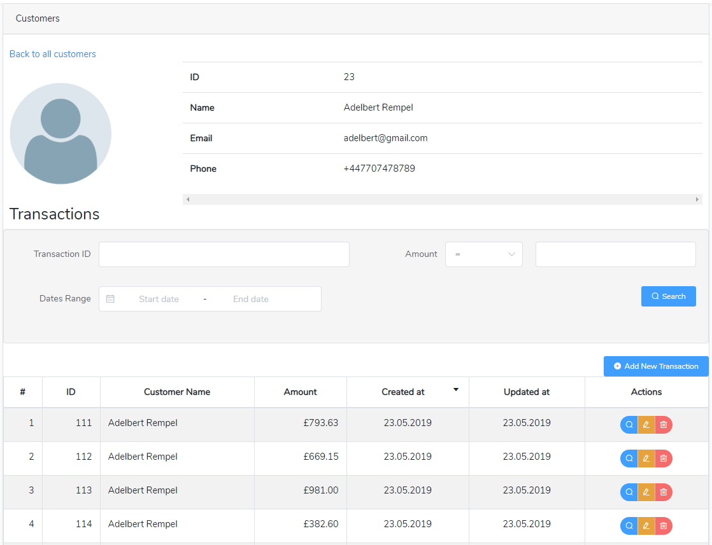

# laravel-api-auth
This create API Rest with Laravel 5.6 Passport Authentication and VUE.js
This 



## Introduction
Create a API that handles request / responses for a made up BANK. This API should be able to handle the
following calls and reply in json format:
- adding of a customer:
    - **Request**: name, cnp 
    - **Response**: customerId    
- getting a transaction:
    - **Request**: customerId, transactionId 
    - **Response**: transactionId, amount, date
- getting transaction by filters:
    - **Request**: customerId, amount, date, offset, limit
    - **Response**: an array of transactions    
- adding a transaction::
    - **Request**: customerId, amount
    - **Response**: transactionId, customerId, amount, date
- updating a transaction:
    - **Request**: transactionId, amount
    - **Response**: transactionId, customerId, amount, date
- deleting a transaction:
    - **Request**: trasactionId
    - **Response**: success/fail
    
## Frameworks
- Backend Laravel 5.6
- Frontend Vue.js with (vuex and vue-router), Element UI components and vuetable-2 for Grid pagination

## Installation
1- run the following composer command to install Laravel
```  
    composer install
```
This will install all dependencies for laravel

2- Vue js Installation
run the following composer command to node models and vue js
```  
    npm install
```
If you use ```homestead``` on windows then use parameter ```--no-bin-links``` as the following:
```
    npm install --no-bin-links
```

3- Config Database:
create database and set up the connection and name in **.env** file
```
    DB_CONNECTION=mysql
    DB_HOST=127.0.0.1
    DB_PORT=3306
    DB_DATABASE=laravel-api
    DB_USERNAME=homestead
    DB_PASSWORD=secret
```
 
 4- open terminal in the root folder of project and Run Migration:
 ```$xslt
    php artisan migrate
```

5- Generate keys: for Laravel passports
 ```$xslt
    php artisan passport:install
```
This command will create the encryption keys needed to generate secure access tokens. In addition, the command will create “personal access” and “password grant” clients which will be used to generate access tokens

6- Run Seeds
```$xslt
    php artisan db:seed
```
This will insert fake data as the following:
- 2 test users with password **123456**
- 50 customers with random number (1-10) transactions for each one


7- Run the project on browser
- Open your browser to project link 
- this will display login form
- Login as one of 2 users that we have created above with seed
    - **user1@gmail.com** and password 123456
    - **user2@gmail.com** and password 123456

That's it 

## API Routes paths

| path | methods | Description |
|:--------|:--------|:--------|
| /api/login | post | post user email and password |
| /api/register | post | To register user |
| /api/details | post | to get user details |
| /api/customers | get | Return Jason with customers List with pagination |
| /api/customers/list | get | Return Jason with customers List without pagination |
| /api/customers/{customer_id} | get | Get customer details by ID|
| /api/customers/new | post | Add new customer|
| /api/customers/edit/{customer_id} | post | Update exist customer|
| /api/customers/{customer_id}/transactions | get | List of transactions that belong to target customer id|
| /api/customers/{customer_id}/transactions/add | post | Add new transaction for target customer id|
| /api/customers/{customer_id}/transactions/edit | post | Update existing transactions that belong to target customer id|
| /api/customers/{customer_id}/transactions/delete | post | delete existing transactions that belong to target customer id|
| /api/transactions | get | List of all transactions |
| /api/transactions/{transaction_id} | get | Transaction detail |
| /api/transactions/daily-sum | get | Sum daily all transactions |

## API JSON Request (fot post methods):
### Login (/api/login)
```json
        {
            "email": "string",
            "password": "string"
        }
```


### New customer: (/api/customers/new)
```json
{
	"name": "string",
	"email": "string",
	"phone": "string"
}
```
### Update customer: (/api/customers/edit/customer_id)
```json
{
	"name": "string",
	"email": "string",
	"phone": "string"
}
```

### New Transaction: (/api/customers/{customer_id}/transactions/add)
```json
{
	"amount": 0.00
}
```
### Update Transaction:  (/api/customers/{customer_id}/transactions/update)
```json
{
	"transaction_id": 0,
	"amount": 0.00
}
```

### Update Transaction:  (/api/customers/{customer_id}/transactions/delete)
```json
{
	"transaction_id": 0
}
```


## CRON
This project has one cron job command. to execute command run
```$xslt
    php artisan transactions:sum-day
```
this command get the sum of all transactions from previous day and stores it in transactions_daily_sum table.
for cron job to sxecute the above command I have create schedule in that execute the above command
So rhe App\Console\Karnel.php 
```php

class Kernel extends ConsoleKernel
{
    protected $commands = [
        Commands\TransactionsSumOfDay::class,
    ];

    protected function schedule(Schedule $schedule)
    {
        $schedule->command('transactions:sum-day')
            ->cron('47 23 */2 * *');
    }

    protected function commands()
    {
        $this->load(__DIR__.'/Commands');

        require base_path('routes/console.php');
    }
}
```
By this schedule it will be run every two days at 23:47 P.M

Now open terminal and run:
```$xslt
    crontab -e
```

this will open the crontab file, add the follwing line at the end of file
```$xslt
    47 23 */2 * * php /path-to-your-project/artisan schedule:run >> /dev/null 2>&1
```

## My solution for CRON job
For these type cron jobs that has work on DB only (update or insert) and when we use Mysql
I prefere to use mysql event schedule. I have make this event and put it in folder ```database/migrations/event```  

### use mysql event instead of cronjob.
if you want to use mysql event then in terminal run the following in mysql:
```$xslt
    mysql> SET GLOBAL event_scheduler = ON;
``` 
this will enable event in mysql.
- Now open folder ```database/migrations/event``` and copy the file ```2019_05_27_164504_events_transaction_sum_daily``` to parent folder ```database/migrations```
- Open file ```database/migrations/event/event_transaction_sum.sql``` and change line (4) with date and time yu want to start this schedule.
- final run ```php artisan migrate``` and this will create the event in DB.


